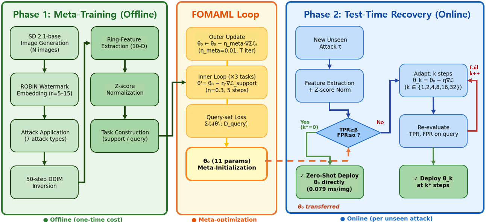
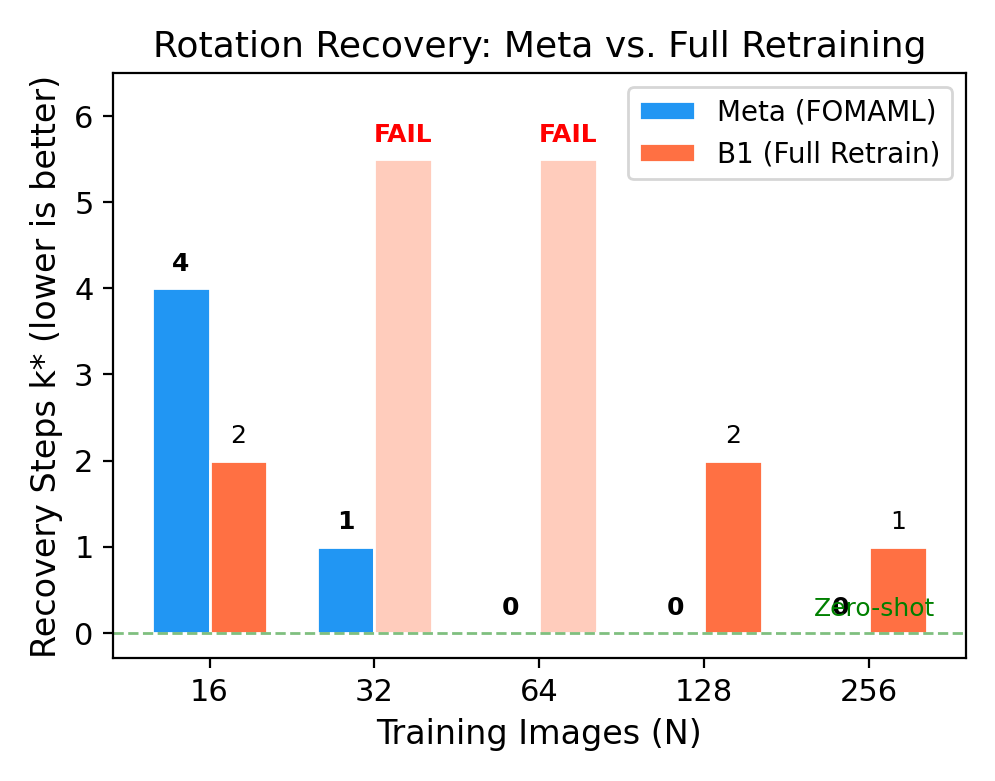
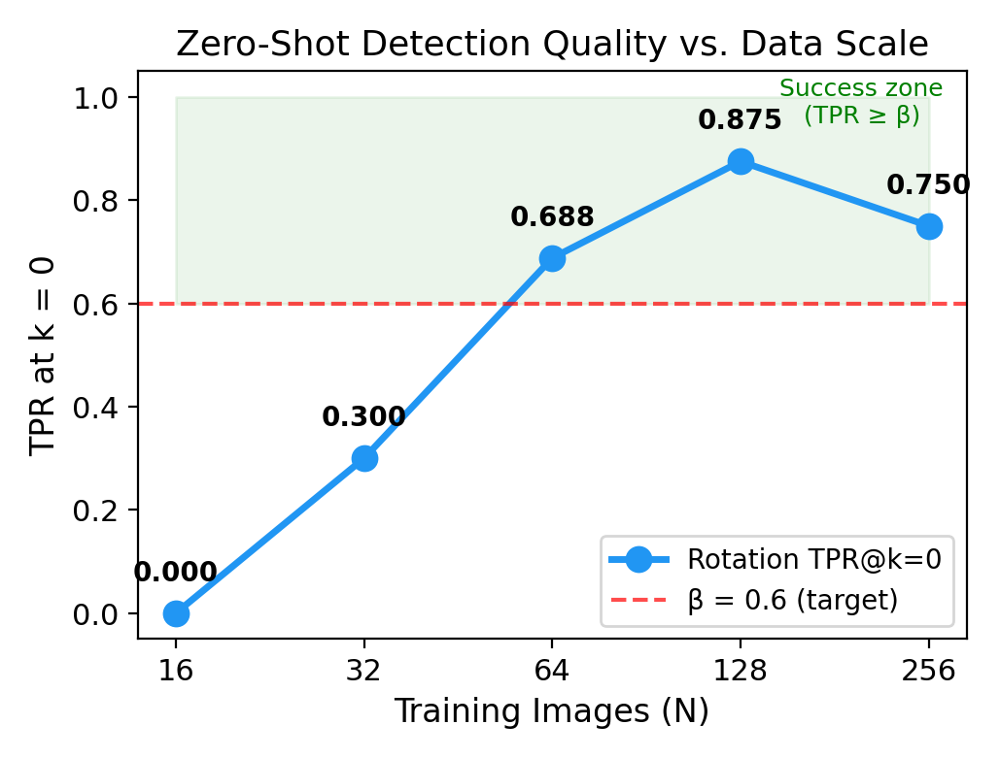
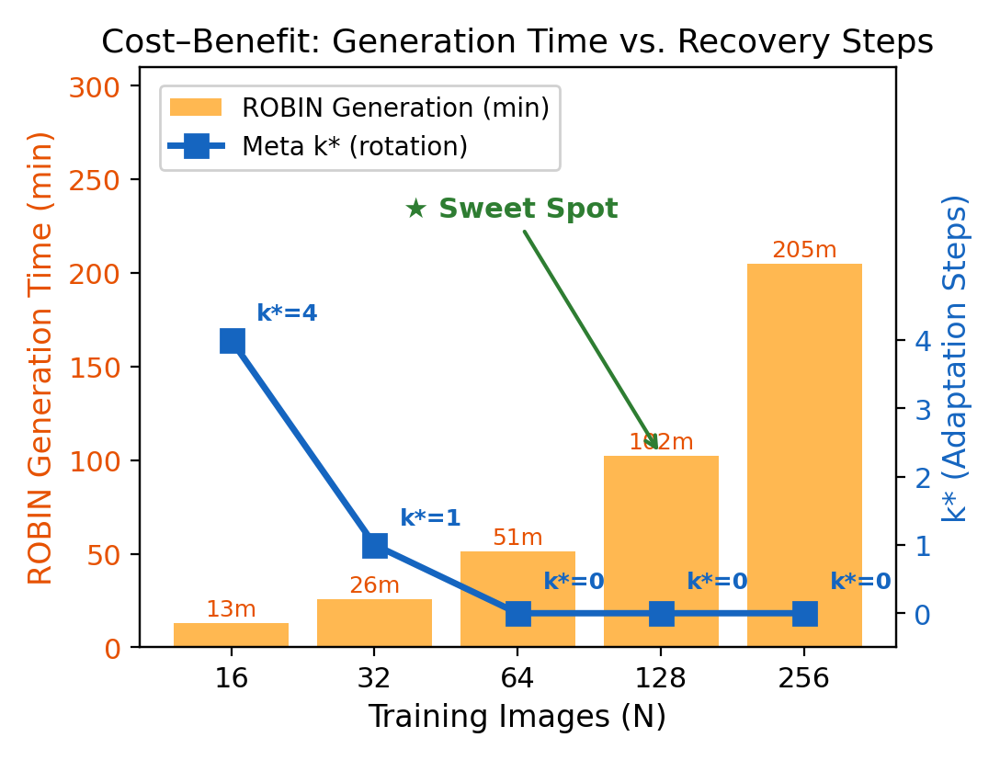
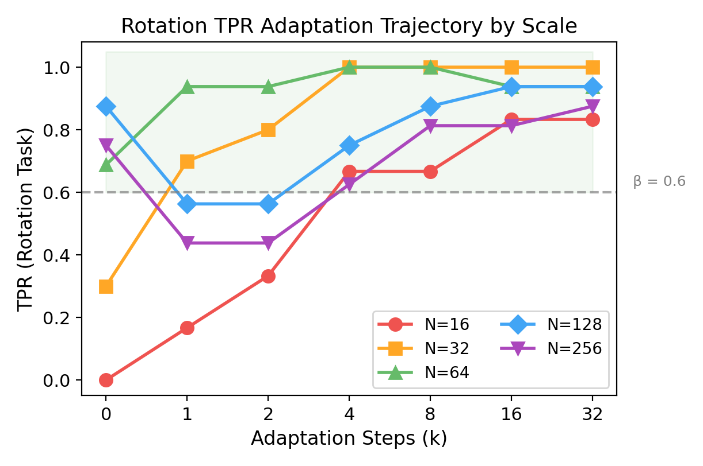
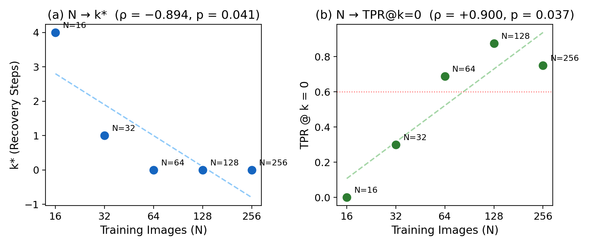

# MWDRAS

**Meta-Watermarking for Detection Recovery under Attack Shift**

> Official implementation of the paper:  
> *"Meta-Watermarking for Detection Recovery under Attack Shift: Empirical Analysis of FOMAML-Based Fast Adaptation"*  
> Submitted to IEEE Access.

[](https://Michael-John-73.github.io/mwdras/)
[](#citation)
[](requirements.txt)

---

## Pipeline



---

## Overview

MWDRAS addresses a practical weakness of ring-pattern watermarks in diffusion models: detection accuracy degrades when the image undergoes an unseen attack type at inference time. Rather than retraining a detector from scratch for every new attack, MWDRAS meta-trains a lightweight logistic detection head using **FOMAML** (First-Order Model-Agnostic Meta-Learning). In the paper setting, recovery is measured by the minimum adaptation step needed to satisfy a fixed operating point of TPR ≥ 0.6 and FPR ≤ 0.17. On the unseen rotation task at N=128, the meta-initialized detector reaches zero-shot recovery (k*=0) with TPR=0.875 and FPR=0.063, whereas full retraining requires k*=2.

The watermark substrate is **ROBIN** ([Liu et al., NeurIPS 2024](https://arxiv.org/abs/2410.04votre)), used as-is without modification. MWDRAS operates entirely on the ROBIN score layer.

---

## Repository Structure

```
MWDRAS/
├── mwdras_bridge.py          # Entry point — connects ROBIN output to meta-learner
├── mwdras_meta_learners.py   # FOMAMLLearner, ReptileLearner, evaluation utilities
├── mwdras_meta_runner.py     # Meta-training + baseline evaluation pipeline
├── mwdras_result_metrics.py  # Severity metrics, MCS, SI, bootstrap CI
├── gen_figures.py            # Reproduces all paper figures (Fig. 2–6)
├── gen_flow.py               # Reproduces Fig. 1 pipeline diagram
├── robin_config.json         # ROBIN parameter mapping for bridge (edit before use)
└── requirements.txt
```

> **ROBIN source** is **not included**. Clone [robin_official](https://github.com/XuandongZhao/ROBIN) separately and set `--robin-root` accordingly.

---

## Quick Start

### 1. Install dependencies

```bash
pip install -r requirements.txt
```

### 2. Edit `robin_config.json`

Set your paths:
```json
"robin_root": { "value": "/path/to/robin_official" },
"model_id":   { "value": "stabilityai/stable-diffusion-2-1-base" },
"wm_path":    { "value": "/path/to/robin_official/ckpts/no_training_r5_15.pt" }
```

### 3. Run the full pipeline

```bash
python mwdras_bridge.py \
  --robin-root  /path/to/robin_official \
  --model-id    stabilityai/stable-diffusion-2-1-base \
  --wm-path     /path/to/ckpts/no_training_r5_15.pt \
  --end 64 \
  --bridge-output-root ./outputs_mwdras_64img
```

The pipeline:
1. Calls ROBIN (`inject_wm_inner_latent_robin.py`) to generate clean/watermarked score dumps across 7 attacks.
2. Builds the task manifest and per-attack feature files.
3. Runs FOMAML meta-training and evaluates Meta vs. Baselines B1–B3.
4. Saves results to `./outputs_mwdras_64img/meta_out/meta_fomaml_results.json`.

### 4. Skip ROBIN (use existing score dump)

```bash
python mwdras_bridge.py \
  --skip-robin-run \
  --existing-score-dump ./outputs_mwdras_64img/robin_runtime_score_dump.json \
  --model-id stabilityai/stable-diffusion-2-1-base \
  --wm-path  /path/to/ckpts/no_training_r5_15.pt \
  --bridge-output-root ./outputs_mwdras_64img
```

### 5. Reproduce figures

```bash
python gen_figures.py   # Fig. 2–6
python gen_flow.py      # Fig. 1 (pipeline diagram)
```

---

## Method

```
ROBIN score dump  ──►  Task split (train/val/test)
                              │
                    FOMAML meta-training (outer loop)
                              │
                    k* search (inner adaptation steps)
                              │
                    Evaluation: TPR @ k*, FPR, AUC
```

### Baselines

| ID | Name | Description |
|----|------|-------------|
| Meta | **FOMAML** | Meta-initialized head, k-step fast adaptation |
| B1 | Full Retrain | Random init, task-specific training |
| B2 | Generic Fine-tune | Mean of train-task adapted weights → fine-tune |
| B3 | Threshold-only | Frozen weights, per-task threshold recalibration |

### Paper-Aligned Highlights

| Setting | Meta result | Comparator | Note |
|---------|-------------|------------|------|
| Rotation, N=128 | k*=0, TPR=0.875, FPR=0.063 | Full retraining: k*=2 | Zero-shot recovery on the unseen rotation task |
| Rotation, N≥64 | k*=0 | — | Zero-shot recovery is sustained across the tested rotation scales |
| Noise task | Limited recovery | Threshold-only can be stronger at some scales | Recovery remains task-dependent under high-noise corruption |
| Decision time | 0.079 ms per image after shared DDIM inversion | 43,000× classification-stage-only speedup | End-to-end latency is still dominated by the shared DDIM inversion stage |

<p align="center">
  
  
</p>
<p align="center">
  <em>Left: rotation-task recovery step across scales. &nbsp; Right: zero-shot TPR across scales, peaking at N=128.</em>
</p>

<p align="center">
  
  
</p>
<p align="center">
  <em>Left: cost-benefit trade-off, with N=128 as the paper's preferred operating point. &nbsp; Right: rotation-task TPR adaptation trajectory across scales.</em>
</p>

<p align="center">
  
</p>
<p align="center">
  <em>Exploratory five-scale Spearman correlations between training scale and recovery metrics.</em>
</p>

---

## ROBIN Integration

MWDRAS does **not** modify any ROBIN source files. The bridge file `mwdras_bridge.py` invokes ROBIN as a subprocess:

```
mwdras_bridge.py
    │
    ├─ subprocess ──► robin_official/inject_wm_inner_latent_robin.py
    │                  (generates score dump: clean_scores, watermarked_scores per attack)
    │
    └─ direct call ──► mwdras_meta_runner.run(cfg_path)
                        (reads score dump, builds tasks, runs FOMAML)
```

The only ROBIN variables exposed to MWDRAS are listed in `robin_config.json`:
- Watermark geometry: `w_channel`, `w_pattern`, `w_mask_shape`, `w_up_radius`, `w_low_radius`
- Diffusion settings: `model_id`, `wm_path`, `num_inference_steps`, `guidance_scale`

---

## Reproducibility

| Item | Value |
|------|-------|
| Watermark checkpoint | `ckpts/no_training_r5_15.pt` (random init, no training) |
| `global_seed` | 123 |
| `split_seed` | 456 |
| `alpha_fpr` | 0.17 |
| `tpr_target_beta` | 0.6 |
| Calibration | Fixed threshold from no-attack support set (B3 recalibrates per task) |
| ROBIN substrate | Unmodified `robin_official/` |

---

## Citation

```bibtex
@misc{yun2026mwdras,
  title   = {Meta-Watermarking for Detection Recovery under Attack Shift:
             Empirical Analysis of FOMAML-Based Fast Adaptation},
  author  = {Yun, Hyeong Gyun and Park, Jung Min and Kim, Hye Young},
  note    = {Submitted to IEEE Access},
  year    = {2026}
}
```

---

## License

Source code: MIT License.  
ROBIN substrate ([robin_official](https://github.com/XuandongZhao/ROBIN)): refer to the original repository for licensing terms.
